杭州的秋天总是来得很温柔。

从九月到十一月，我们在这里留下了四段关于“秋日”的记忆。

---

## 📅 09.17：窗景与游戏

到酒店安顿好后，躺在床上看着窗外的景色，一时间竟分不清此刻是清晨还是傍晚。

但这不重要，重要的是我们又见面了。

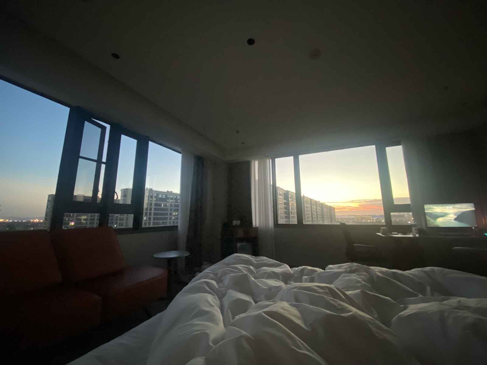

### 🍲 食物与“妥协”

这家酒店的早餐依旧保持着高水准，是我们早起的动力。

中午不想出门，点了几个家常小炒，简单却落胃。

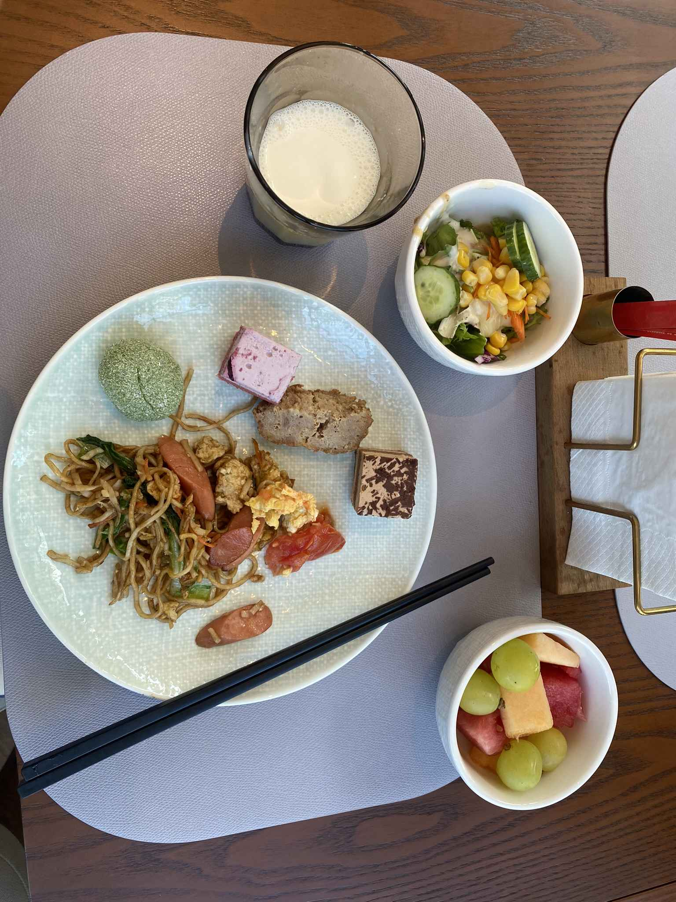
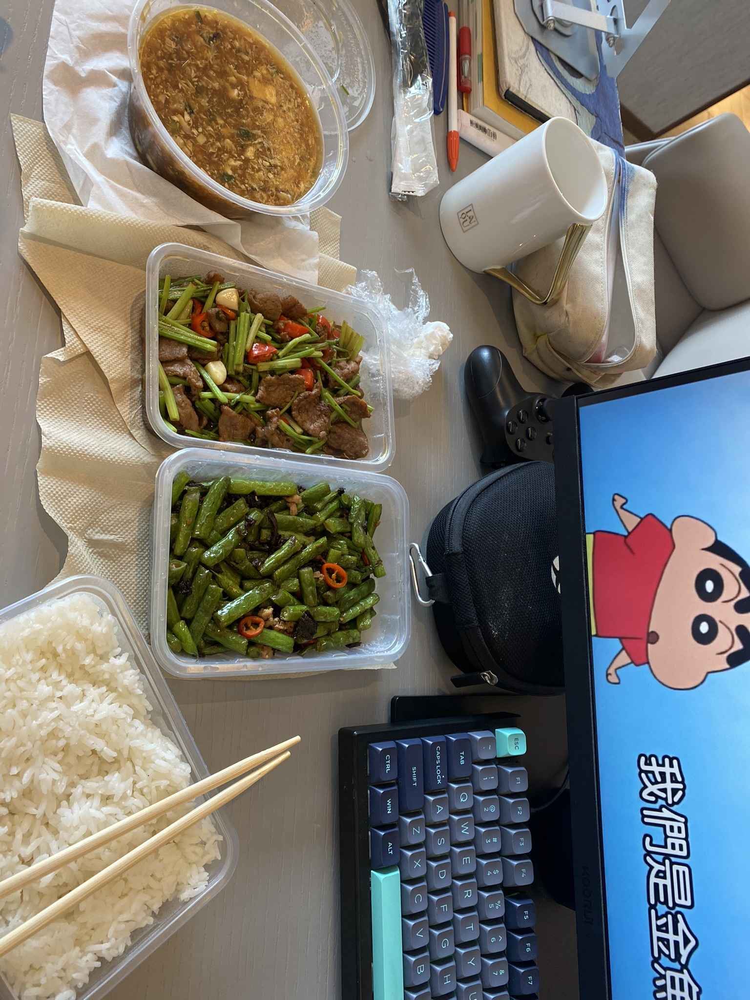

酒店附近没有麦当劳，我们只能又吃了一顿 KFC。

吃饱喝足，继续我们的保留节目——**《双人成行》**。

这次见面还打卡了韩式烤肉和日料，主打一个“吃得丰富”。

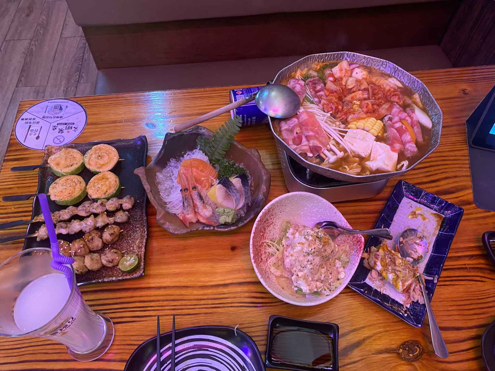

---

## 📅 10.12：电竞之夜

十月中旬，秋意渐浓。

难得的是，我们又一起下楼吃了那顿熟悉的酒店自助早餐。

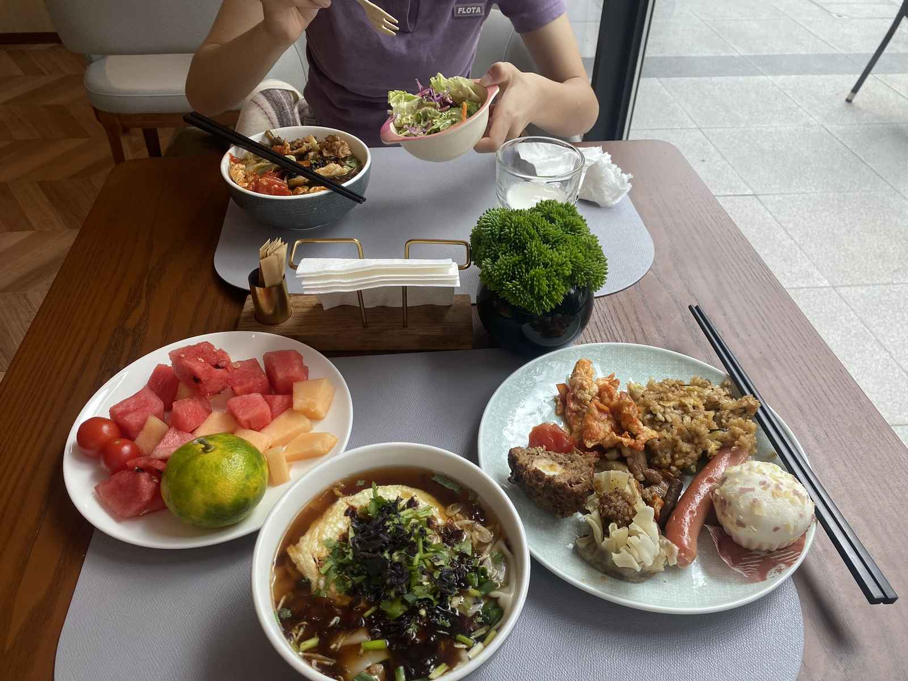

这一天的重头戏是 **LOL 世界赛**。

买好肯德基，两个人窝在房间里边吃边看比赛。

这种“快乐肥宅”的双倍快乐，大概只有懂的人才懂吧。

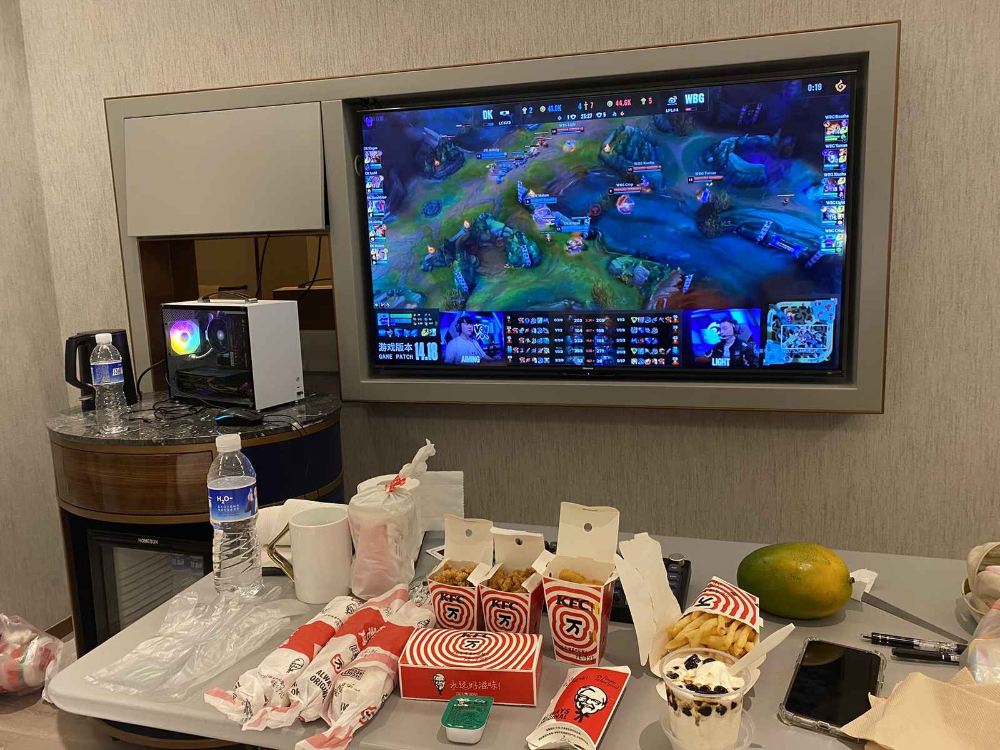

---

## 📅 10.27：江边漫步

这次主打一个“松弛感”。

白天哪里也没去，就这样躺在酒店的大床上看电视，虚度时光也是一种浪漫。

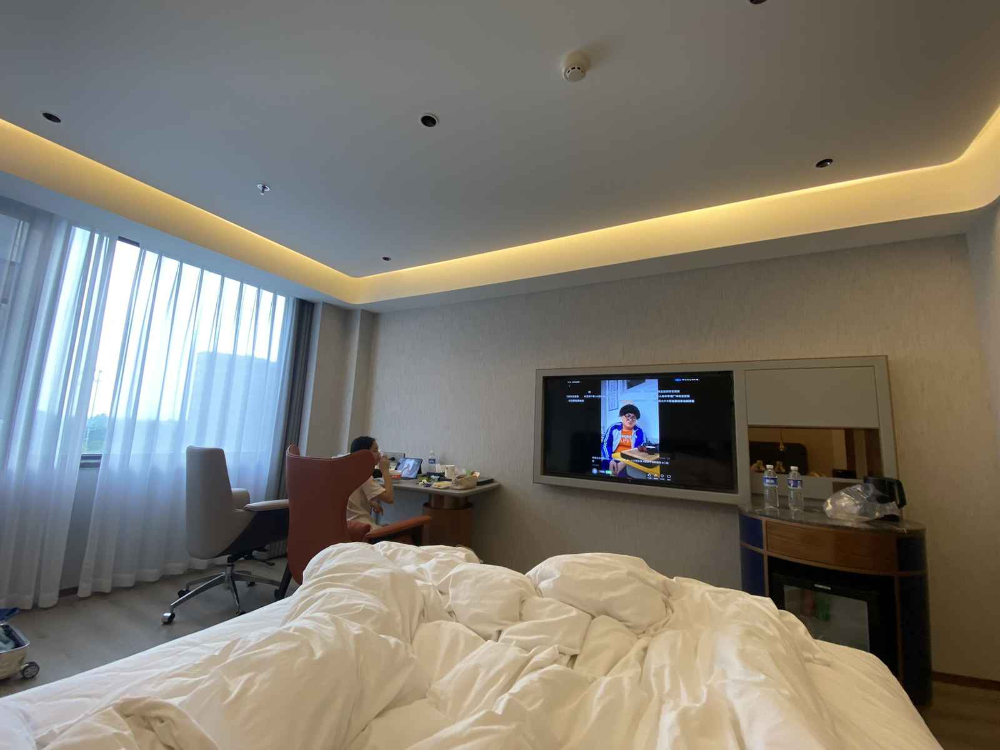

傍晚时分，我们去钱塘江边走了走。

江风吹走了城市的喧嚣，看着对岸的灯火亮起，心里觉得格外平静。

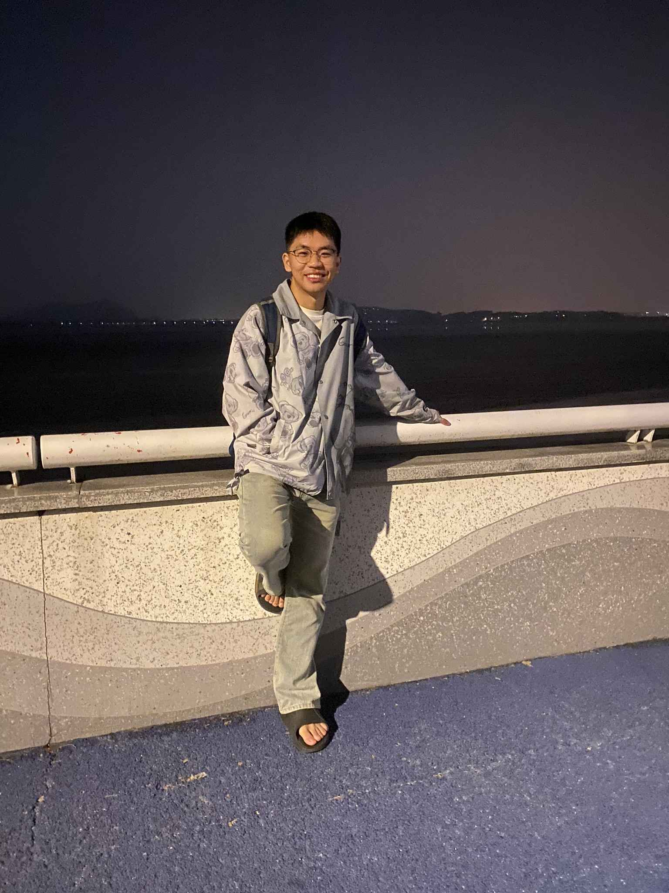
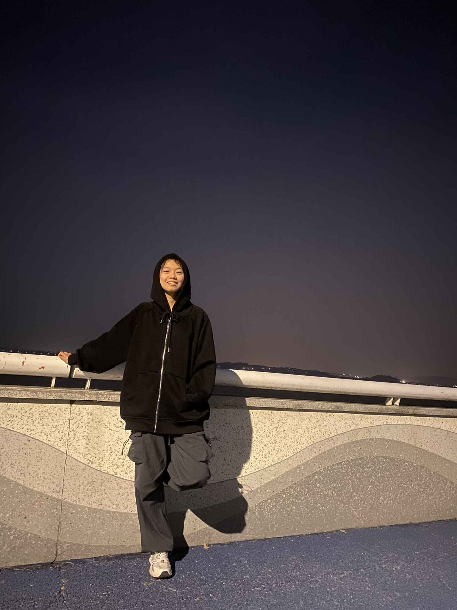

---

## 📅 11.18：童心未泯

深秋的最后一次见面。

在酒店的投影仪前，光影交错。

我们比了一个大大的爱心，那一刻仿佛穿越了时光，回想起了当年的点点滴滴。

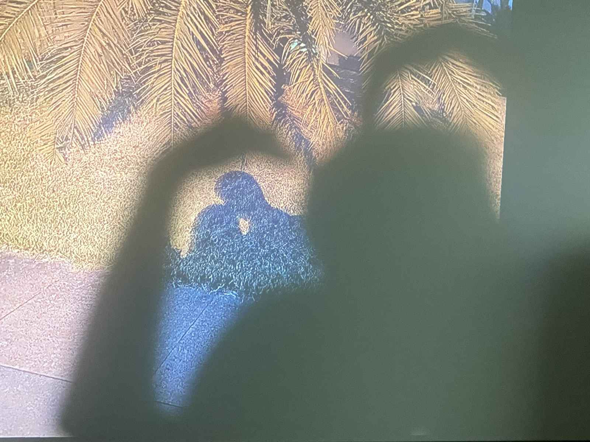

### 🎡 杭州乐园的碰碰车

这次终于和她一起去了游乐园！

虽然已经是大人了，但坐上**碰碰车**的那一刻，我们好像都变回了小孩。

横冲直撞的快乐，是秋天最好的收尾。

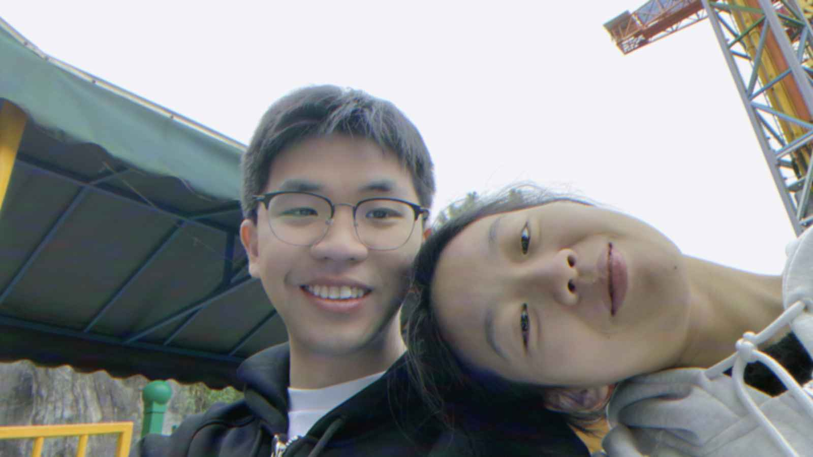
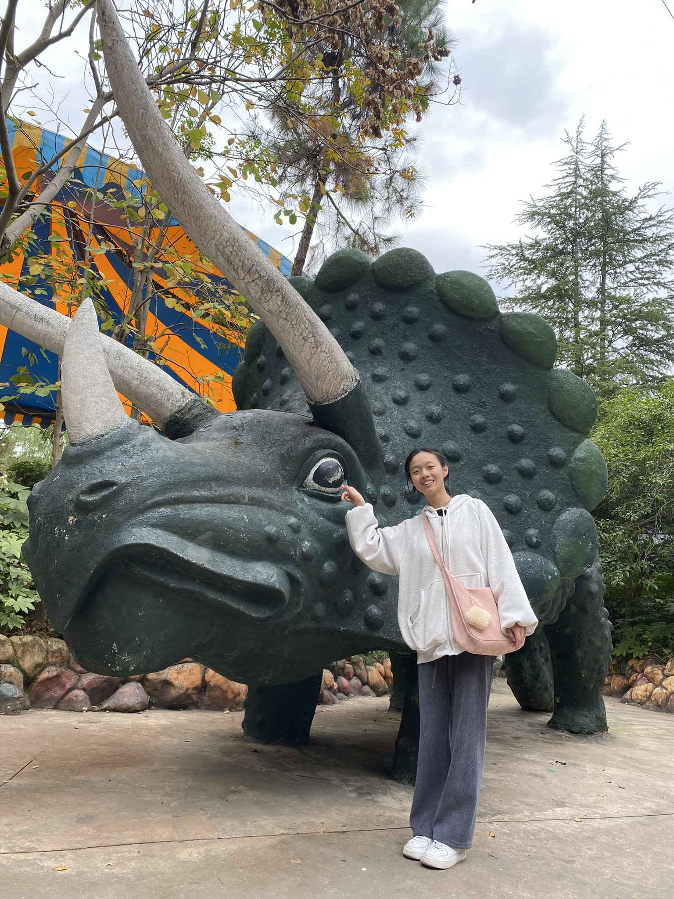
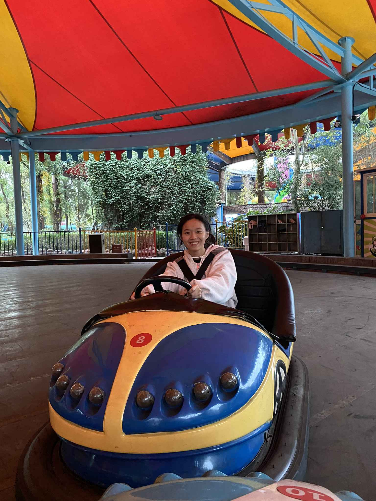