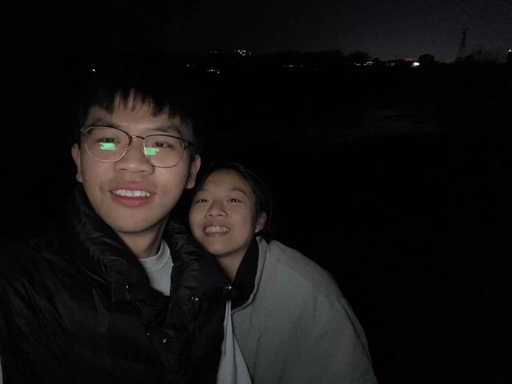
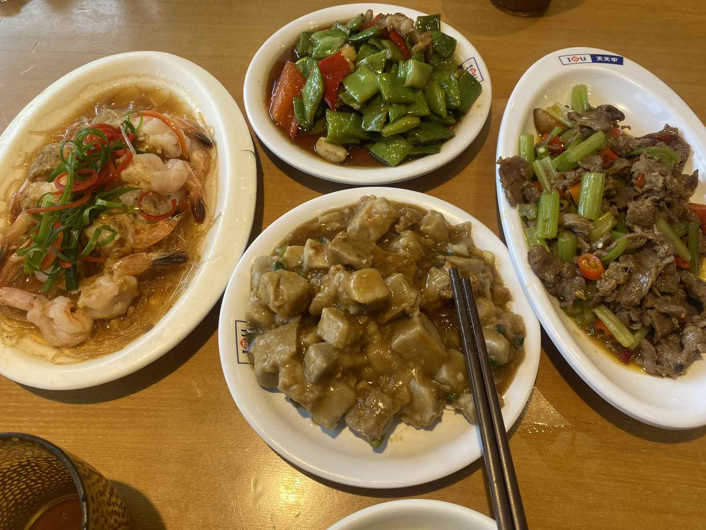
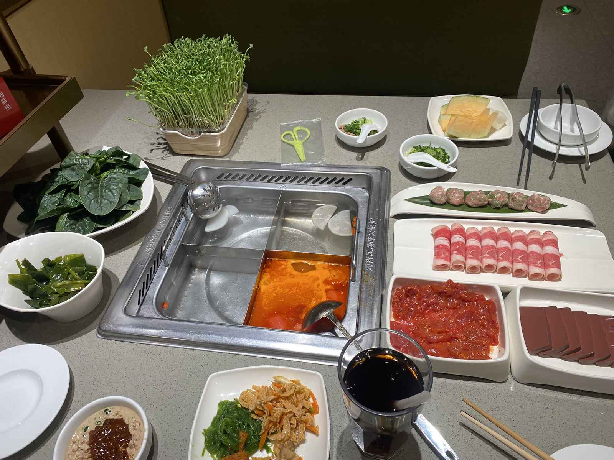
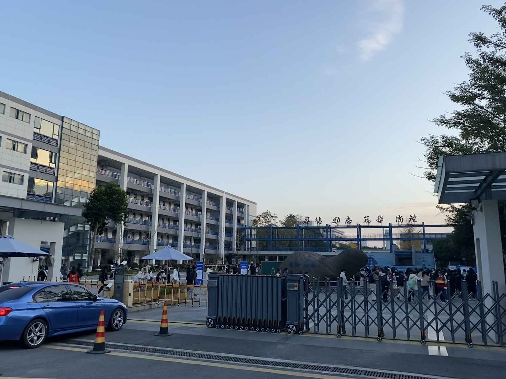
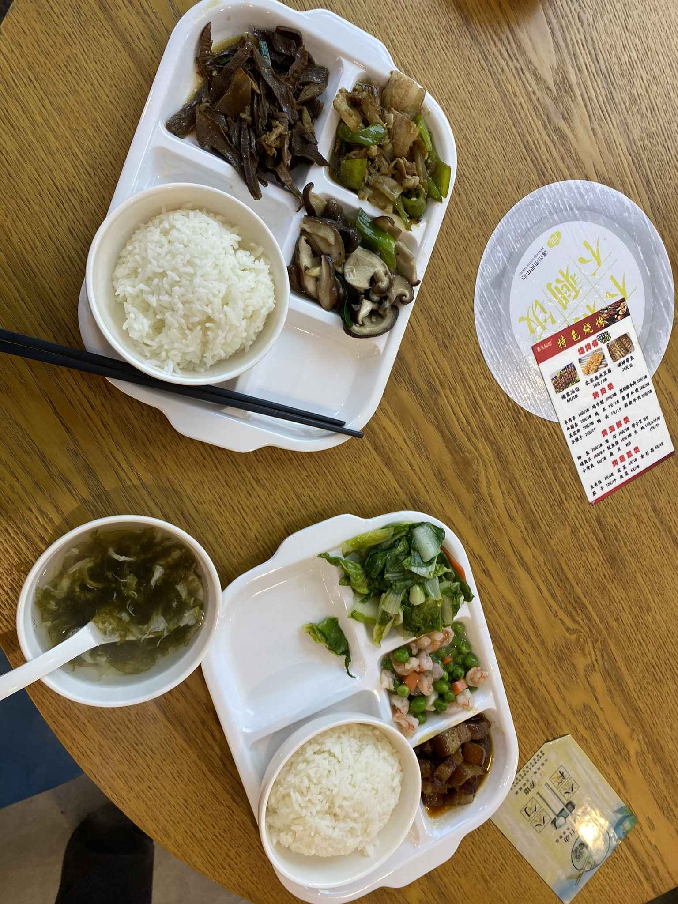
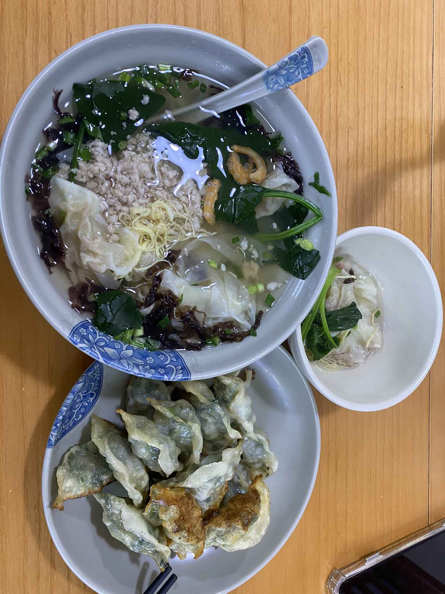
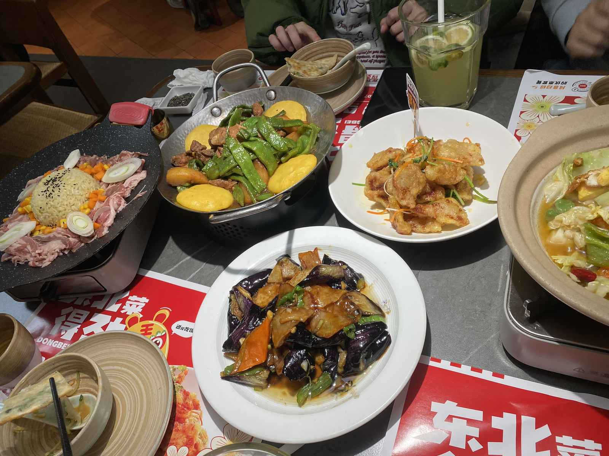
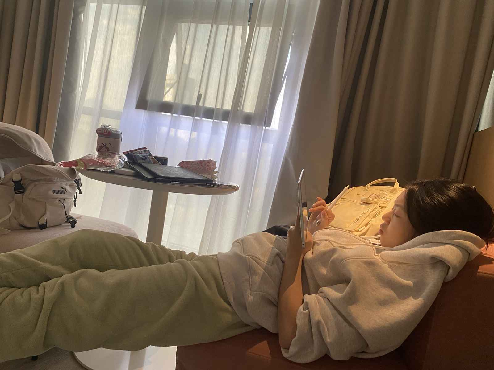

十二月，是考试的季节，也是梦想落地的时刻。

在这个月，我们先后奔赴了各自的“战场”。

---

## 📅 12.08：东阳·省考落幕

这一天，省考在东阳落下帷幕。

因为手握 Offer，我对这场考试并没有太重的得失心，更多是抱着“体验”的心态去应对。

或许恰恰是因为这份松弛感，下笔反而格外顺手。

当然，走出考场那一刻最大的快乐，并不是考试结束本身，而是我可以去找她了。

夜晚的东阳江风虽冷，但心是热的。我们在江边留下了这张合影。

---

## 📅 12.20：温州·考研冲刺

半个月后，坐标切换到温州。

这一次，主角是她，身份是考研战士；而我，是她的专属后勤。

### 🍲 考前充能

考前的一天，心态最重要。

午饭我们去吃了天天中餐厅。

晚饭去了海底捞，用热腾腾的火锅驱散冬天的寒气，也稍微缓解一下考前的紧张。

### 🏫 奔赴考场

到了真正上战场的那一刻。

目送她走进考场入口，背影坚定。

我在外面等她凯旋。

为了节省时间休息，第一天的午餐我们在考点附近简单吃了快餐。

虽然匆忙，但只要能填饱肚子，就有力气继续下午的战斗。

第二天一早，用一顿美味的早餐开启最后的征程。

### 🎉 考后放松

终于，铃声响起，笔锋入鞘！

考完后的第一件事，当然是 **吃顿好的！**

回到学校附近，约了 jjz 和她男朋友，四人组再次聚首。

这次选了分量十足的东北菜，大口吃肉，庆祝这段备考时光的结束。

回到酒店，她还是拿出平板。

看着她认真对答案的样子，我想，无论结果如何，这段全力以赴的日子本身就已经闪闪发光了。

> 无论这个冬天的结果如何，春暖花开的时候，我们都会变得更好。
