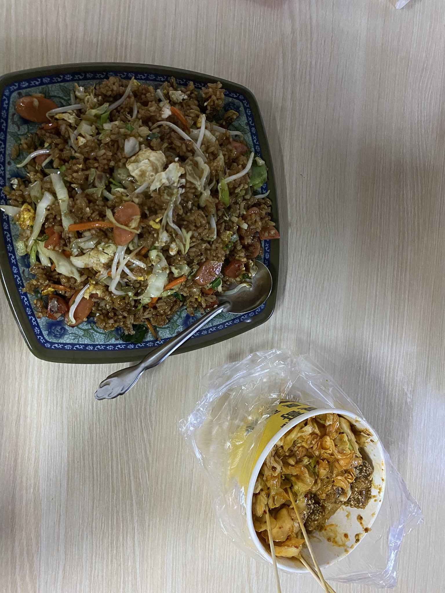
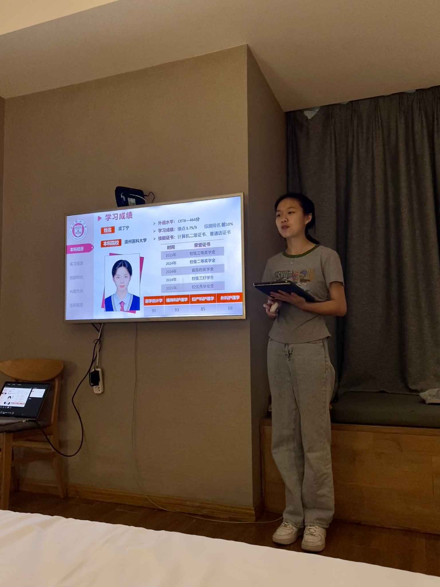
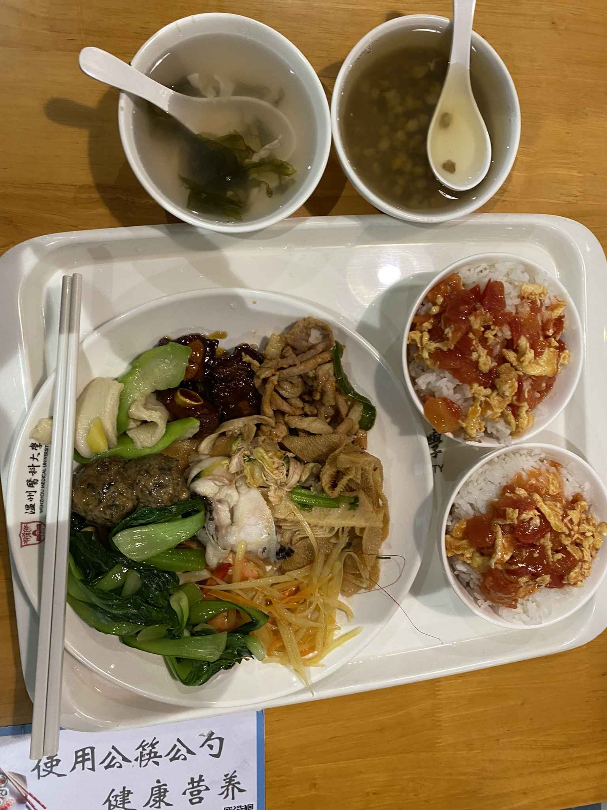
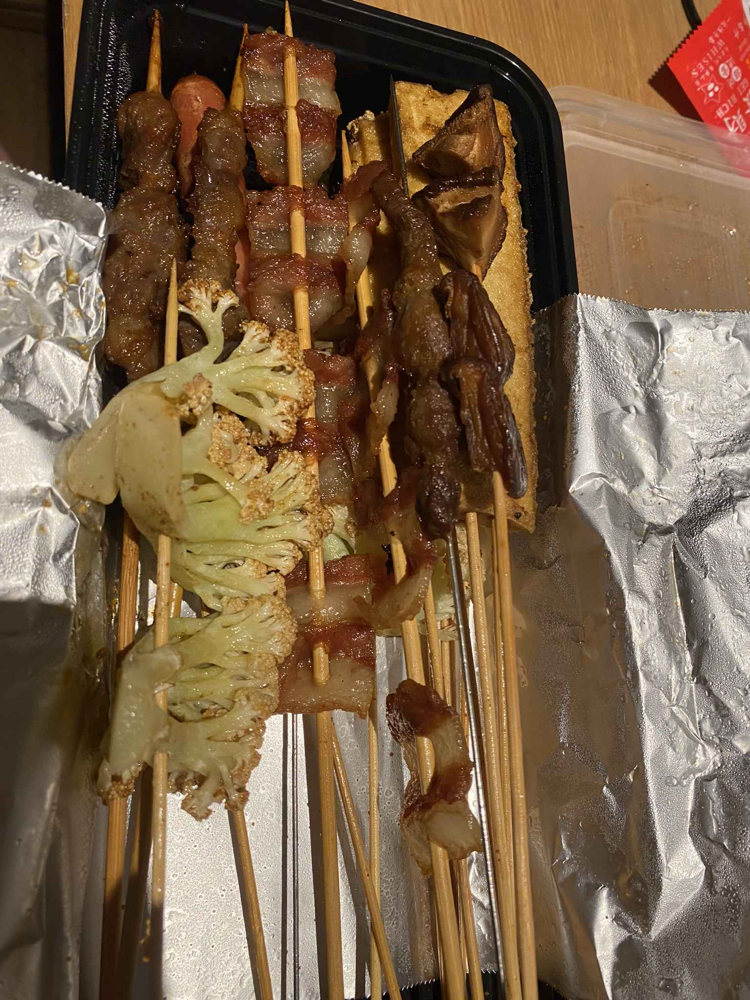
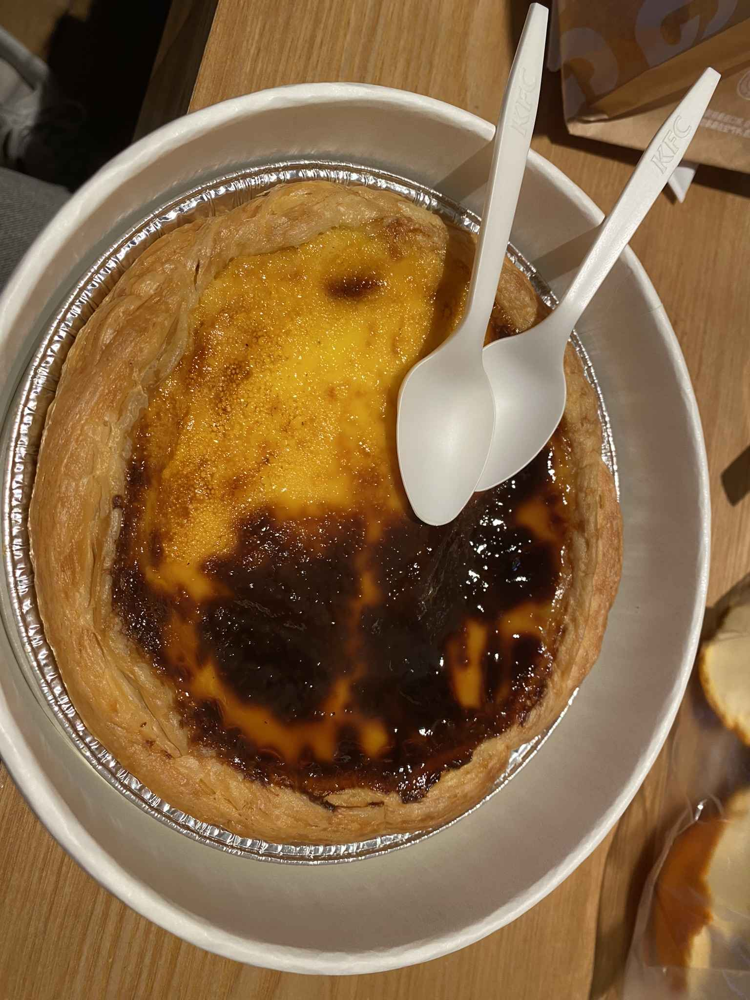
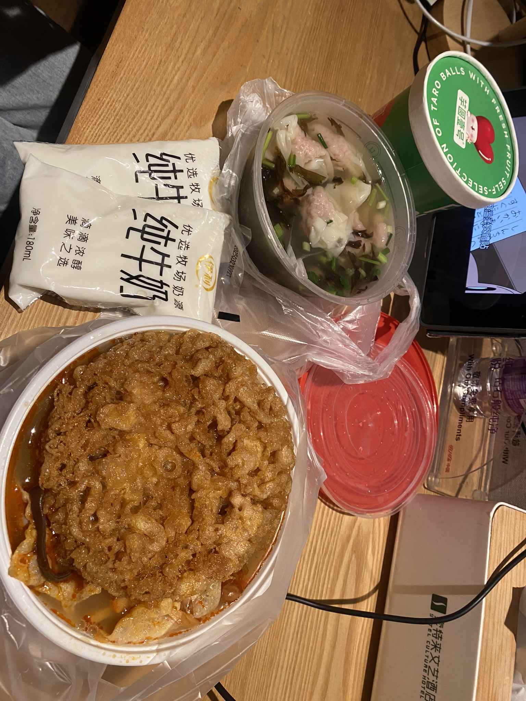

尘埃落定，捷报传来。

考研成绩出来后，她成功入围了复试！

这一次，我们一起回到了久违的母校。

这所学校对我们来说意义非凡：它既是她考研的目标院校，也是我们**初次见面的地方**。

命运的齿轮转了一圈，又回到了原点，只是这一次，是为了更好的出发。

---

## 🍛 记忆中的味道

回到学校，第一件事就是直奔那条熟悉的小吃街。

点了一份念叨了很久的**台州炒饭**。

时光荏苒，我们都已脱去当年幼稚模样。

但炒饭摊的老板娘似乎还是记忆中的样子，依旧那么热情好客。吃进嘴里的那一刻，仿佛时间没有流逝。

---

## 📝 备战时刻

当然，这次回来的主线任务还是复试。

回到酒店，切换到认真模式。看着她一遍遍练习自我介绍、调整 PPT 的细节，我在旁边充当唯一的听众和面试官。

认真的人最发光，我相信她一定没问题。

---

## 😋 舌尖上的校园

除了备战，还要把许久未吃的校园美食通通打卡一遍。

专门去吃了学校的**智慧餐厅**，那种特有的“食堂味”，不管吃多少次大餐都替代不了。

还有那些藏在街角巷尾的小吃，我们也一样没落下：

滋滋冒油的烧烤、比脸还大的巨大蛋挞，还有闻着臭吃着香的螺蛳粉、瘦肉丸和芋圆壹号。

这一趟，是陪考，也是一场味蕾的怀旧之旅。

> 在梦开始的地方，祝她一战成硕，我们顶峰相见！
